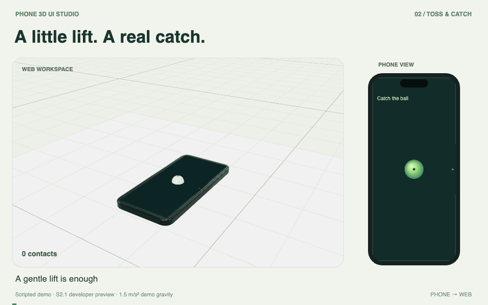
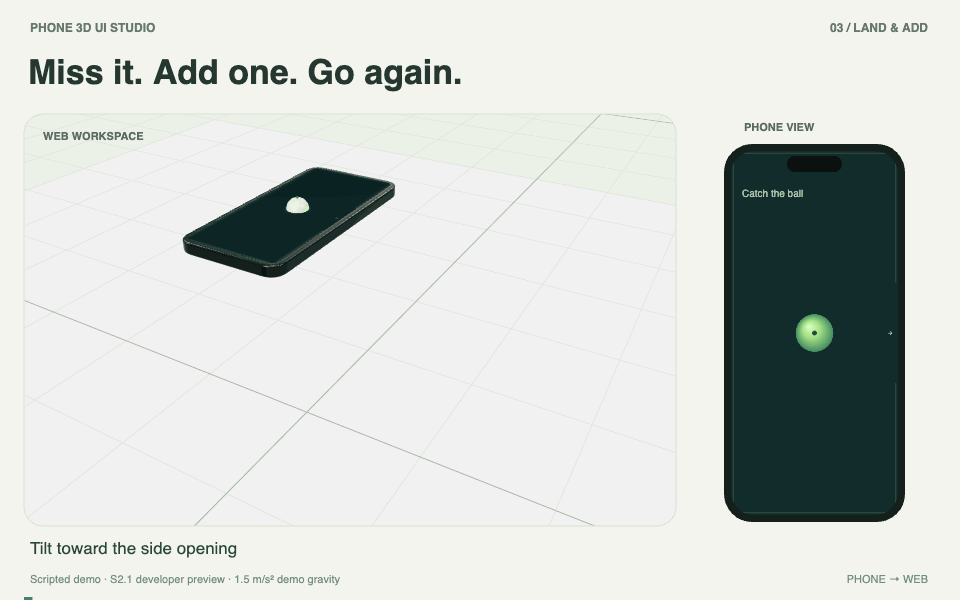
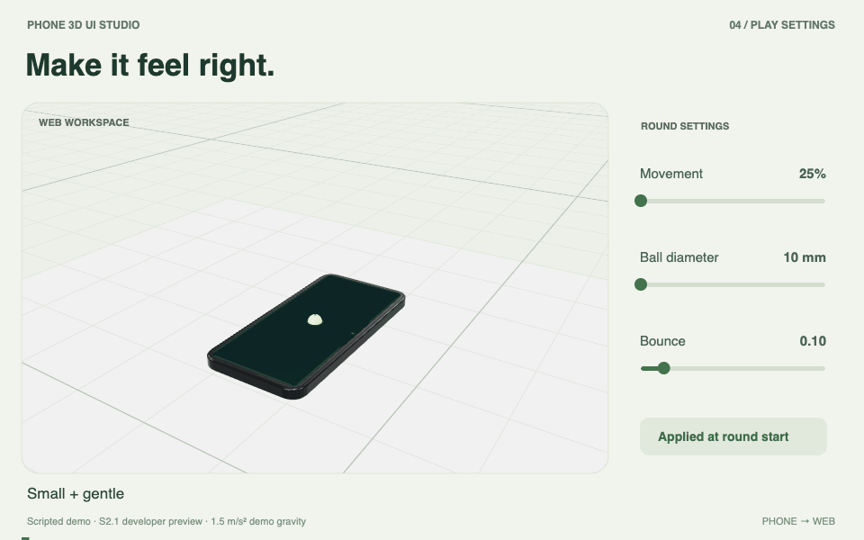

# Phone 3D UI Studio

A reusable desktop studio for presenting a phone UI on a controllable 3D device, with camera presets, lighting, backgrounds, recording, and—after the content-production MVP is stable—live screen and device-pose synchronization.

## Spatial interaction — in motion

A preview of the new **S2.1 Elastic Tray** experience: move a phone through space, gently toss a ball, catch it, and add a new one after a miss.

These are **scripted renders**, using the project's original phone model and Rapier physics. The phone inset is a projected view of the same world state. They illustrate the interaction; they are not camera footage, a live network recording, or wireless reliability evidence.

**Try the developer preview:** [S2.1 release](https://github.com/Popcornnnnnnnn/phone-3d-ui-studio/releases/tag/v0.2.1-alpha.1) · [Setup guide](https://github.com/Popcornnnnnnnn/phone-3d-ui-studio/blob/v0.2.1-alpha.1/docs/QUICKSTART.zh-CN.md) · [Spatial implementation](https://github.com/Popcornnnnnnnn/phone-3d-ui-studio/pull/21)

The spatial preview is on its own branch; the default `main` checkout still contains the studio baseline described below. A physical iPhone and your own Xcode signing are required to play.

### A little lift. A real catch.

The tray's movement supplies the energy. The same ball leaves the screen, rises through the Web world, and makes contact with the tray again.



<table>
<tr>
<td width="50%"><strong>Your phone, in space</strong><br />Translation and rotation in a shared 3D workspace.</td>
<td width="50%"><strong>Miss it. Add one. Go again.</strong><br />A new active ball; the old ball remains on the ground.</td>
</tr>
<tr>
<td><a href="docs/media/spatial-movement.gif"></a></td>
<td><a href="docs/media/land-and-add.gif"></a></td>
</tr>
</table>

### Make it feel right

Adjust movement scale, ball diameter, and bounce. Each preset below starts a new round, just as **Apply & restart** does in the app.



[Media details and limitations](docs/media/README.md)

---

- GitHub repository: <https://github.com/Popcornnnnnnnn/phone-3d-ui-studio>
- Delivery board: <https://github.com/users/Popcornnnnnnnn/projects/3>

## Studio baseline status

- Accepted: M0 project foundation; M2 screen-video vertical slice
- Active: M1 iPhone 17 visual rework candidate; previous geometry-only acceptance was reopened
- Baseline start: 2026-09-02
- Target content-production MVP: 2026-09-18
- Target live-sync release candidate: 2026-10-09
- Target acceptance: 2026-10-12
- Current review item: [M1 — visually recalibrate the iPhone 17 asset](https://github.com/Popcornnnnnnnn/phone-3d-ui-studio/issues/2)
- Next M2 work item after visual sign-off: [reusable studio and camera presets](https://github.com/Popcornnnnnnnn/phone-3d-ui-studio/issues/5)

The schedule assumes one primary developer, a Mac and iPhone available for testing, and no App Store release requirement. See [PROJECT_PLAN.md](PROJECT_PLAN.md) for the estimate, gates, and acceptance criteria.

## Product boundary

The project deliberately separates two deliverables:

1. **Content-production MVP** — prerecorded phone-screen video on a 3D phone, reusable studio presets, camera motion, and recording.
2. **Live-sync extension** — live phone-screen transport and real-device orientation synchronization.

The first deliverable is independently useful and does not wait for iOS capture constraints to be solved.

## Repository structure

```text
docs/                  Architecture and decision records
src/model/             Calibrated device dimensions and tests
src/scene/             Three.js model and studio scene
.github/               Issue templates and project automation metadata
PROJECT_PLAN.md        Schedule, milestones, effort, risks, acceptance gates
ROADMAP.md             Date-based delivery checkpoints
```

The current application contains an original procedural iPhone 17 black reference model, an independently addressable screen mesh, deterministic front/back review views, three visual presets, simulated motion, orbit controls, and explicit screen/pose source contracts. A local video can be selected, played, paused, reset, and mapped to the screen with non-stretching portrait/landscape contain scaling. Confirmed dimensions and approximation boundaries are recorded in [docs/references/iphone-17-black.md](docs/references/iphone-17-black.md). Live capture, camera timeline, final-scene recording, and saved project state are not implemented yet.

## Local development

Requires Node.js 24 or newer.

```bash
npm install
npm run dev
```

The local studio runs at <http://127.0.0.1:4317>. Run the complete verification suite with `npm run check`.

## Working rules

- Keep source, generated media, captured phone content, secrets, and build caches separate.
- Never commit captured personal phone screens, signing material, provisioning profiles, `.env` files, or recordings.
- Local video selection uses an in-memory object URL; the app does not copy, upload, or serialize the selected file path.
- A visually convincing render is not proof that live capture or pose synchronization works.
- Every milestone closes only after its acceptance check is recorded in the corresponding GitHub issue.
